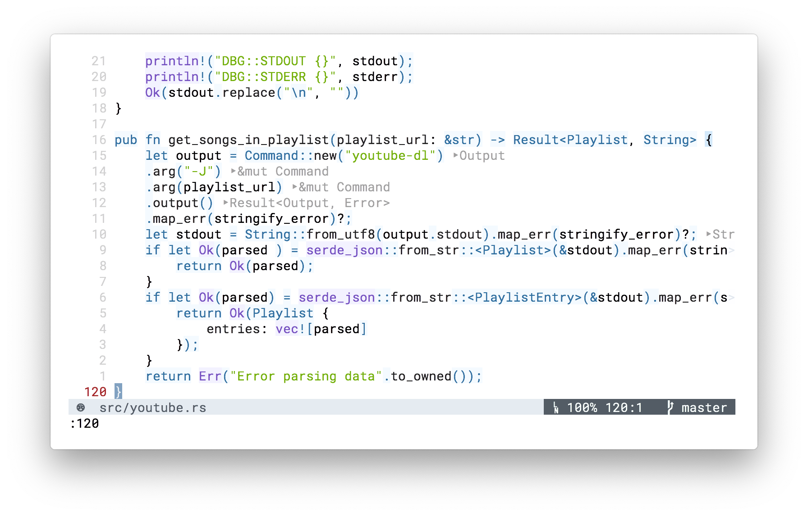

## Espresso Tutti Theme



Based on:

- https://tmtheme-editor.herokuapp.com/#!/editor/theme/Espresso%20Tutti
- https://www.vim.org/scripts/script.php?script_id=2670

How to install:

```
Plug 'huytd/vim-espresso-tutti'
```

And then

```
colo espresso-tutti
```
